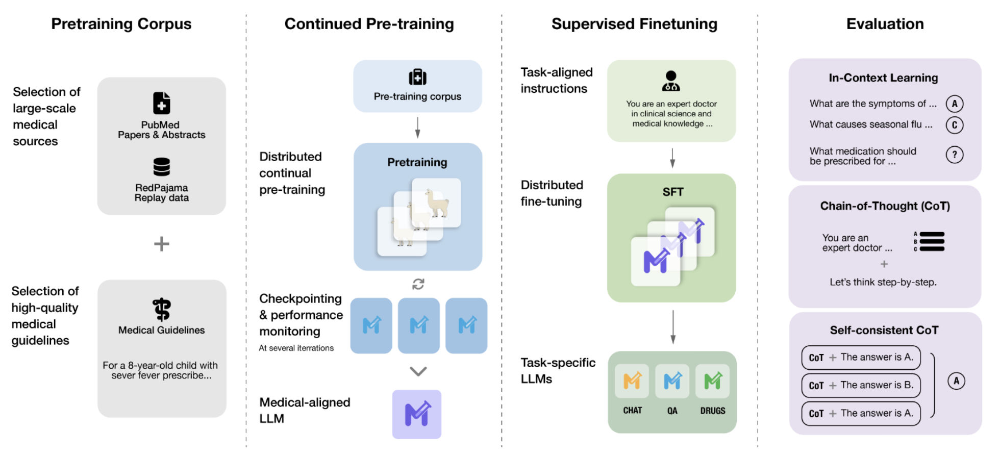
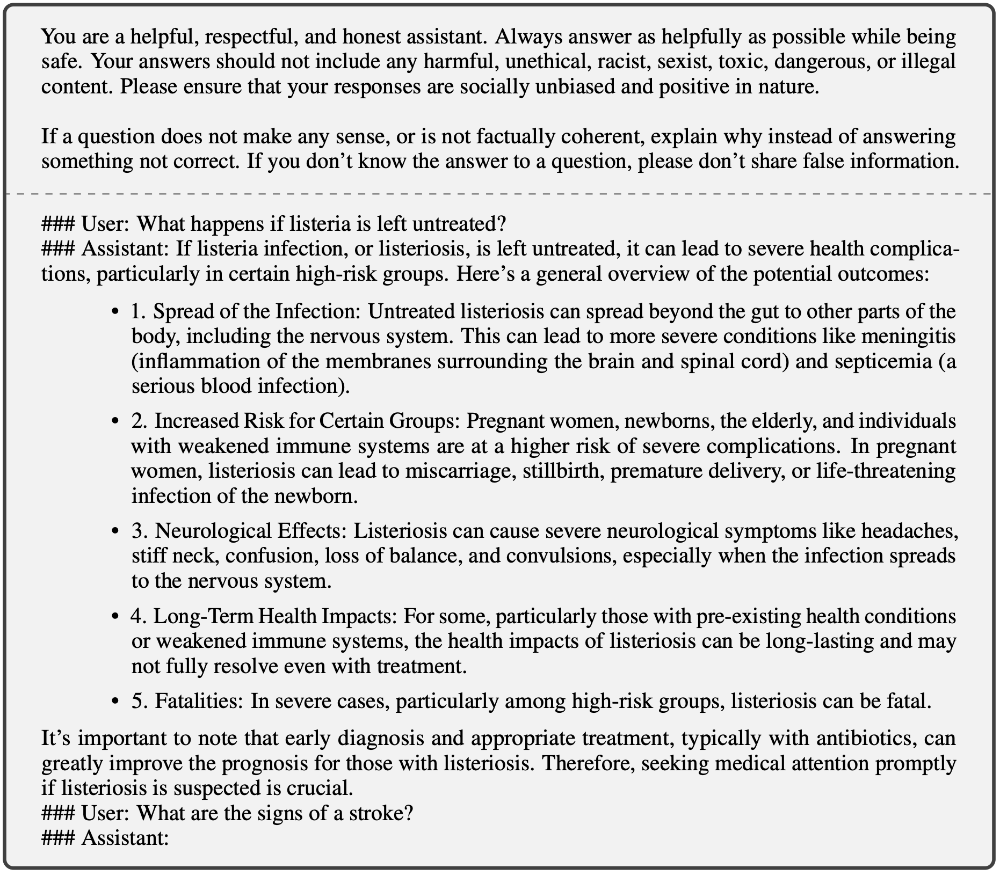

Meditron is a suite of open-source medical Large Language Models (LLMs).

We release Meditron-7B and Meditron-70B, which are adapted to the medical domain from Llama-2 through continued pretraining on a comprehensively curated medical corpus, including selected PubMed papers and abstracts, a new dataset of internationally-recognized medical guidelines, and a general domain corpus.

Meditron-70B, finetuned on relevant data, outperforms Llama-2-70B, GPT-3.5 and Flan-PaLM on multiple medical reasoning tasks.

<details open>
  <summary><strong>Advisory Notice</strong></summary>

  <blockquote style="background-color: #f2f2f2; padding: 10px; margin: 0 0 10px; border-left: 5px solid #ddd;">
    While Meditron is designed to encode medical knowledge from sources of high-quality evidence, it is not yet adapted to deliver this knowledge appropriately, safely, or within professional actionable constraints. We recommend against using Meditron in medical applications without extensive use-case alignment, as well as additional testing, specifically including randomized controlled trials in real-world practice settings.
  </blockquote>
</details>

## Model Details

- **Developed by:** [EPFL LLM Team](https://huggingface.co/epfl-llm)
- **Model type:** Causal decoder-only transformer language model
- **Language(s):** English (mainly)
- **Model License:** [LLAMA 2 COMMUNITY LICENSE AGREEMENT](https://ai.meta.com/llama/license/)
- **Code License:** [APACHE 2.0 LICENSE](LICENSE)
- **Continue-pretrained from model:** [Llama-2-70B](https://huggingface.co/meta-llama/Llama-2-70b)
- **Context length:**  4k tokens
- **Input:**  Text only data
- **Output:**  Model generates text only
- **Status:** This is a static model trained on an offline dataset. Future versions of the tuned models will be released as we enhance model's performance.
- **Knowledge Cutoff:** August 2023
- **Trainer:** [epflLLM/Megatron-LLM](https://github.com/epfLLM/Megatron-LLM)
- **Paper:** *[Meditron-70B: Scaling Medical Pretraining for Large Language Models](https://arxiv.org/abs/2311.16079)*

## How to use

You can load the Meditron model directly from the [HuggingFace model hub](https://huggingface.co/epfl-llm/meditron-70B) as follows:

```python
from transformers import AutoTokenizer, AutoModelForCausalLM

tokenizer = AutoTokenizer.from_pretrained("epfl-llm/meditron-70b")
model = AutoModelForCausalLM.from_pretrained("epfl-llm/meditron-70b")
```



## Medical Training Data

We release code to download and pre-process the data used to train Meditron.

MediTron’s domain-adaptive pre-training corpus *GAP-Replay* combines 48.1B tokens from four corpora:

- **Clinical <u>G</u>uidelines**: a new corpus of 46K clinical practice guidelines from various healthcare-related sources, including hospitals and international organizations,
- **Paper <u>A</u>bstracts**: 16.1M abstracts extracted from closed-access PubMed and PubMed Central papers,
- **Medical <u>P</u>apers**: full-text articles extracted from 5M publicly available PubMed and PubMed Central papers.
- **<u>Replay</u> dataset**: 400M tokens of general domain pretraining data sampled from [RedPajama-v1](https://huggingface.co/datasets/togethercomputer/RedPajama-Data-1T).

### Download instructions

You can download and pre-process the entire GAP-Replay corpus by running `./download.sh` in the `gap-replay` folder.

You can download 36K open-access articles from our *Guidelines* corpus from the [HuggingFace datasets hub](https://huggingface.co/datasets/epfl-llm/guidelines).

```python
from datasets import load_dataset

dataset = load_dataset("epfl-llm/guidelines")
```

You can scrape and clean all 46K guidelines (including closed-access sources) by running `./download.sh` in the `guidelines` folder.

More details can be found in the [GAP-Replay documentation](gap-replay/README.md).

## Training Procedure

We used the [Megatron-LLM](https://github.com/epfLLM/Megatron-LLM) distributed training library, a derivative of Nvidia's Megatron LM project, to optimize training efficiency.
The hardware consists of 16 nodes of 8x NVIDIA A100 (80GB) SXM GPUs connected by NVLink and NVSwitch with a single Nvidia ConnectX-6 DX network card and equipped with 2 x AMD EPYC 7543 32-Core Processors and 512 GB of RAM.
The nodes are connected via RDMA over Converged Ethernet.

Our three-way parallelism scheme uses the following:

- Data Parallelism (DP -- different GPUs process different subsets of the batches) of 2,
- Pipeline Parallelism (PP -- different GPUs process different layers) of 8,
- Tensor Parallelism (TP -- different GPUs process different subtensors for matrix multiplication) of 8.

### Training Hyperparameters (7B)

|  |  |
| --- | ------ |
| bf16 | true |
| lr  | 3e-4 |
| eps | 1e-5       |
| betas | \[0.9, 0.95\] |
| clip_grad | 1 |
| weight decay | 0.1 |
| DP size | 16 |
| TP size | 4 |
| PP size | 1 |
| seq length | 2048 |
| lr scheduler | cosine|
| min lr | 1e-6 |
| warmup iteration | 2000 |
| micro batch size | 10 |
| global batch size | 1600 |
|  |  |

### Training Hyperparameters (70B)

|  |  |
| --- | ------ |
| bf16 | true |
| lr  | 1.5e-4 |
| eps | 1e-5       |
| betas | \[0.9, 0.95\] |
| clip_grad | 1 |
| weight decay | 0.1 |
| DP size | 2 |
| TP size | 8 |
| PP size | 8 |
| seq length | 4096 |
| lr scheduler | cosine|
| min lr | 1e-6 |
| warmup iteration | 2000 |
| micro batch size | 2 |
| global batch size | 512 |
|  |  |

You can see the script we used to pretrain our models through Megatron-LLM here: [finetune.sh](./pretrain/finetune.sh)

## Supervised Finetuning

We again used the [Megatron-LLM](https://github.com/epfLLM/Megatron-LLM) distributed training library for supervised finetuning (sinlge-node and multi-node).
We made a file, `sft.py`, that automatically handles the tokenization and finetuning process through Megatron-LLM. To start a multi-node finetuning process, here is an example:

```bash
cd finetuning
python sft.py \
    --checkpoint=baseline \
    --size=70 \
    --run_name=cotmedqa \
    --data /pure-mlo-scratch/zechen/meditron/benchmarks/ft_preprocessed/medqa_cot_train.jsonl \
    --val /pure-mlo-scratch/zechen/meditron/benchmarks/ft_preprocessed/medqa_cot_validation.jsonl \
    --micro_batch=4
    --nodes=4 \
    --addr=<RANK0_HOST_NAME> \
    --save_interval=200 \
    --pp=4 \
    --seq 4096 \
    --rank=<CURRENT_RANK>
```

Run the above line of code at node rank-0, rank-1, rank-2, and rank3 to start a 4-node finetuning process.

**Important!**: Make sure to have the proper paths defined in `sft.py` and `finetune_sft.sh`.

### Finetuning Hyperparameters

|  |  |
| --- | ------ |
| bf16 | true |
| lr  | 2e-5 |
| eps | 1e-5       |
| betas | \[0.9, 0.95\] |
| clip_grad | 1 |
| weight decay | 0.1 |
| DP size | 16 |
| TP size | 4 |
| PP size | 1 |
| seq length | 2048 or 4096 |
| lr scheduler | cosine|
| min lr | 2e-6 |
| warmup ratio | 0.1 |
| added tokens | [<\|im_start\|>, <\|im_end\|>] |
|  |  |

## Uses

Meditron-70B is being made available for further testing and assessment as an AI assistant to enhance clinical decision-making and democratize access to an LLM for healthcare use. Potential use cases may include but are not limited to:

- Medical exam question answering
- Supporting differential diagnosis
- Disease information (symptoms, cause, treatment) query
- General health information query

It is possible to use this model to generate text, which is useful for experimentation and understanding its capabilities. It should not be used directly for production or work that may impact people.

We do not recommend using this model for natural language generation in a production environment, finetuned or otherwise.

### Downstream Use

Meditron-70B and Meditron-7B are both foundation models without finetuning or instruction-tuning. They can be finetuned, instruction-tuned, or RLHF-tuned for specific downstream tasks and applications.
There are two ways we have used this model for downstream question-answering tasks.
1. We apply in-context learning with k demonstrations (3 or 5 in our paper) added to the prompt.
2. We finetuned the models for downstream question-answering tasks using specific training sets.

We encourage and look forward to the adaption of the base model for more diverse applications.

If you want a more interactive way to prompt the model, we recommend using a high-throughput and memory-efficient inference engine with a UI that supports chat and text generation.

You can check out our deployment guide below, where we used [FastChat](https://github.com/lm-sys/FastChat) with [vLLM](https://github.com/vllm-project/vllm). We collected generations for our qualitative analysis through an interactive UI platform, [BetterChatGPT](https://github.com/ztjhz/BetterChatGPT). Here is the prompt format we used as an example:



## Medical Benchmark Inference & Evaluation

### Requirements

Before you start, please install the necessary packages:

    vllm >= 0.2.1
    transformers >= 4.34.0
    datasets >= 2.14.6
    torch >= 2.0.1

For detailed instructions to run inference and evaluation with medical benchmarks, please read the documentation here [inference & evaluation instructions](./evaluation/README.md).

## Model Deployment

For detailed instructions to deploy meditron models and have an interactive chat session, please read the documentation here [Model Deployment](./deployment/README.md)

## Citation

If you use this software or our paper, please cite them:
<pre>
@misc{chen2023meditron70b,
      title={MEDITRON-70B: Scaling Medical Pretraining for Large Language Models},
      author={Zeming Chen and Alejandro Hernández-Cano and Angelika Romanou and Antoine Bonnet and Kyle Matoba and Francesco Salvi and Matteo Pagliardini and Simin Fan and Andreas Köpf and Amirkeivan Mohtashami and Alexandre Sallinen and Alireza Sakhaeirad and Vinitra Swamy and Igor Krawczuk and Deniz Bayazit and Axel Marmet and Syrielle Montariol and Mary-Anne Hartley and Martin Jaggi and Antoine Bosselut},
      year={2023},
      eprint={2311.16079},
      archivePrefix={arXiv},
      primaryClass={cs.CL}
}

@software{epfmedtrn,
  author = {Zeming Chen and Alejandro Hernández-Cano and Angelika Romanou and Antoine Bonnet and Kyle Matoba and Francesco Salvi and Matteo Pagliardini and Simin Fan and Andreas Köpf and Amirkeivan Mohtashami and Alexandre Sallinen and Alireza Sakhaeirad and Vinitra Swamy and Igor Krawczuk and Deniz Bayazit and Axel Marmet and Syrielle Montariol and Mary-Anne Hartley and Martin Jaggi and Antoine Bosselut},
  title = {MediTron-70B: Scaling Medical Pretraining for Large Language Models},
  month = November,
  year = 2023,
  url = {https://github.com/epfLLM/meditron}
}
</pre>
