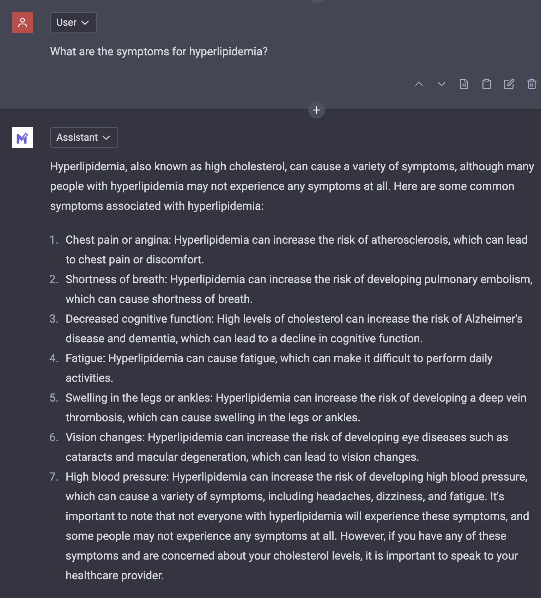
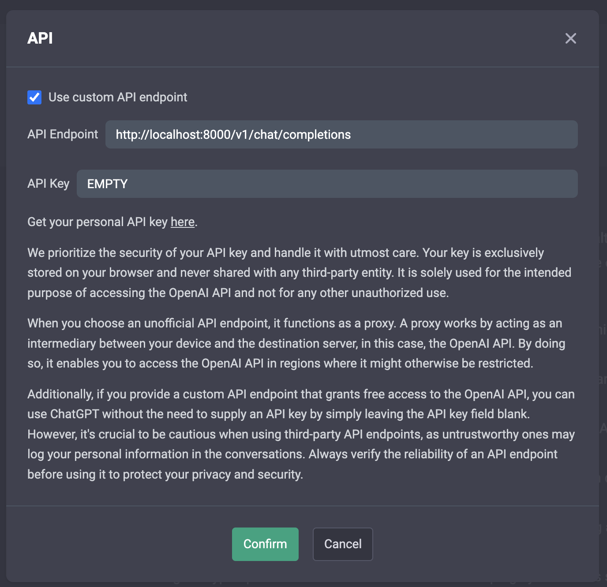

# Model Deployment

All the generations from the qualitative analysis in the paper are generated using [FastChat](https://github.com/lm-sys/FastChat)'s deployment platform.
Since FastChat does not officially support Meditron models, there are several steps required to enable the deployment

1. Clone this repository and navigate to the FastChat folder

    ```bash
    git clone https://github.com/lm-sys/FastChat.git
    cd FastChat
    ```

    If you are running on Mac:

    ```bash
    brew install rust cmake
    ```

2. Add a model adapter to `fastchat/model/model_adapter.py`

    ```python
    class MeditronAdapter(BaseModelAdapter):
    """The model adapter for Meditron"""

    def match(self, model_path: str):
        return "meditron" in model_path.lower()

    def load_model(self, model_path: str, from_pretrained_kwargs: dict):
        model, tokenizer = super().load_model(model_path, from_pretrained_kwargs)
        model.config.eos_token_id = tokenizer.eos_token_id
        model.config.pad_token_id = tokenizer.pad_token_id
        return model, tokenizer

    def get_default_conv_template(self, model_path: str) -> Conversation:
        return get_conv_template("one_shot") # or meditron_one_shot, meditron
    ```

3. Register some conversation templates in `fastchat/conversation.py`

   ```python
   register_conv_template(
        Conversation(
            name="one_shot_medical",
            system_message=system_msg_meditron,
            roles=("User", "Assistant"),
            messages=(
                (
                    "User",
                    "What happens if listeria is left untreated?",
                ),
                (
                    "Assistant",
                    """If listeria infection, or listeriosis, is left untreated, it can lead to severe health complications, particularly in certain high-risk groups. Here's a general overview of the potential outcomes:

   1. Spread of the Infection: Untreated listeriosis can spread beyond the gut to other parts of the body, including the nervous system. This can lead to more severe conditions like meningitis (inflammation of the membranes surrounding the brain and spinal cord) and septicemia (a serious blood infection).
   2. Increased Risk for Certain Groups: Pregnant women, newborns, the elderly, and individuals with weakened immune systems are at a higher risk of severe complications. In pregnant women, listeriosis can lead to miscarriage, stillbirth, premature delivery, or life-threatening infection of the newborn.
   3. Neurological Effects: Listeriosis can cause severe neurological symptoms like headaches, stiff neck, confusion, loss of balance, and convulsions, especially when the infection spreads to the nervous system.
   4. Long-Term Health Impacts: For some, particularly those with pre-existing health conditions or weakened immune systems, the health impacts of listeriosis can be long-lasting and may not fully resolve even with treatment.
   5. Fatalities: In severe cases, particularly among high-risk groups, listeriosis can be fatal.

   It's important to note that early diagnosis and appropriate treatment, typically with antibiotics, can greatly improve the prognosis for those with listeriosis. Therefore, seeking medical attention promptly if listeriosis is suspected is crucial."""
               )
           ),
           offset=2,
           sep_style=SeparatorStyle.ADD_COLON_SINGLE,
           sep="\n### ",
           stop_str=["<\s>", "###", "Assistant:", "User:"]
       )
   )
    ```

    ```python
    register_conv_template(
        Conversation(
            name="zero_shot_medical",
            system_message=system_msg_meditron,
            roles=("User", "Assistant"),
            sep_style=SeparatorStyle.ADD_COLON_SINGLE,
            sep="\n### ",
            stop_str=["<\s>", "###", "Assistant:", "User:"]
        )
    )
    ```

**For easy use, we have a version with modified content supporting medtrion.**

```bash
git clone https://github.com/eric11eca/FastChat.git
cd FastChat
git checkout meditron-deploy
```

## Serving with Web GUI

To serve using the web UI, you need three main components: web servers that interface with users, model workers that host one or more models, and a controller to coordinate the webserver and model workers. You can learn more about the architecture [here](docs/server_arch.md).

Here are the commands to follow in your terminal:

### Launch the controller

```bash
python3 -m fastchat.serve.controller
```

This controller manages the distributed workers.

### Launch the model worker(s)

For example, running `meditron-70b` on 8 GPUs.

```bash
./fastchat.sh \
    -c meditron-70b \
    -m single \
    -n 8
```

Wait until the process finishes loading the model and you see "Uvicorn running on ...". The model worker will register itself to the controller .

### Launch the UI web server

You can use the default gradio web server by running:

By following these steps, you will be able to serve your models using the web UI. You can open your browser and chat with a model now.
If the models do not show up, try to reboot the gradio web server.

```bash
python3 -m fastchat.serve.gradio_web_server
```

This is the user interface that users will interact with.

Or, you can server with OpenAI-compatible APIs provided by FastChat. See documentation [here](https://github.com/lm-sys/FastChat/blob/main/docs/openai_api.md)

To start the API, run the following command:

```bash
python3 -m fastchat.serve.openai_api_server \
    --host localhost \
    --port 8000
```

### Third Party UI

Next, you can use a third-party UI for OpenAI APIs to interact with the model. You will need to specify the host as `http://localhost:8000/v1/chat/completions`.

Here is a UI platform we used, called [BetterChat](https://github.com/ztjhz/)
Get the version we modified for this UI:

```bash
git clone https://github.com/eric11eca/BetterChatGPT
cd BetterChatGPT
git checkout meditron-ui
```

To start the UI, simply run:

```bash
npm install
npm run dev
```

You can access the UI at `http://localhost:5173/`:



First, update the API to be the one provided by FastChat's OpenAI API: `http://localhost:8000/v1/chat/completions`.



Next, select the proper models to start interaction:


