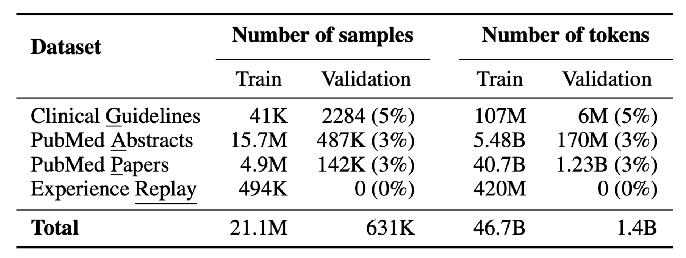
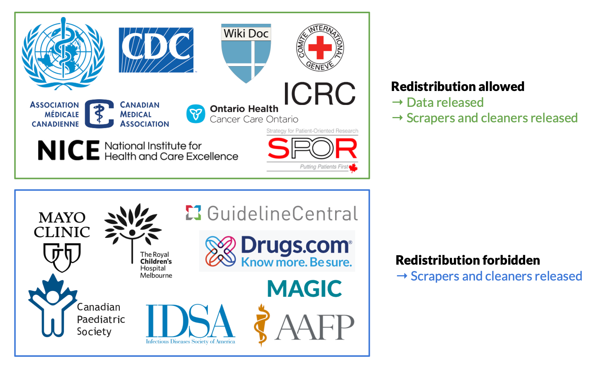

## *GAP-Replay*: MediTron's Pre-Training corpus

This directory contains code to download and pre-process the GAP-Replay corpus. 

MediTron’s domain-adaptive pre-training corpus **GAP-Replay** combines 48.1B tokens from four datasets:

- **Clinical <u>G</u>uidelines**: a new dataset of 46K clinical practice guidelines from various healthcare-related sources, 
- **Paper <u>A</u>bstracts**: abstracts from 16.1M closed-access PubMed and PubMed Central papers, 
- **Medical <u>P</u>apers**: full-text articles extracted from 5M publicly available PubMed and PubMed Central papers.
- **<u>Replay</u> dataset**: general domain data distilled to compose 1\% of the entire corpus.

<p align="center">

</p>  

### 1. Downloading GAP-Replay

To download all datasets and combine them into a single GAP-Replay corpus, run: 
```bash
./download.sh
```

#### 1.1. Downloading PubMed papers and abstracts

To download and pre-process PubMed papers and abstracts from the [S2ORC API](https://www.semanticscholar.org/product/api), run:

```bash
./pubmed/download.sh
```

#### 1.2. Downloading Replay Data

To download and sub-sample replay data from the [RedPajama-v1](https://huggingface.co/datasets/togethercomputer/RedPajama-Data-1T) dataset, run: 

```bash
./replay/download.sh
```

#### 1.3. Downloading Guidelines 

Only 8 of 16 sources of clinical guidelines allow for redistribution (namely CCO, CDC, CMA, ICRC, NICE, SPOR, WHO & WikiDoc). For these 36K open-access articles, we release raw and clean versions of the data on the [HuggingFace datasets hub](https://huggingface.co/datasets/epfl-llm/guidelines).

```python
from datasets import load_dataset

dataset = load_dataset("epfl-llm/guidelines")
```

To scrape *all* 16 sources, you can use our web scrapers and cleaning code in `guidelines/` by first setting up the dependencies.

```bash
# Install dependencies
pip install -r guidelines/requirements.txt

# Use spacy to get the English language pipeline
python -m spacy download en_core_web_sm 

# Install scipdf from GitHub to convert PDFs to text
pip install git+https://github.com/titipata/scipdf_parser
```

Then, to download and pre-process all 46K clinical practice guidelines, run:

```bash
./guidelines/download.sh
```

All sources of clinical practice guidelines supported by our scrapers are shown below.

<p align="center">

</p>  

| Source | Full Name | Source tag | Total guidelines | Total words | Audience | Released |
|-|-|-|-|-|-|-|
| **[AAFP](https://www.aafp.org)** | American Academy of Family Physicians | `aafp` | 50 | 9.4K | Doctor | No |
| **[CCO](https://www.cancercareontario.ca/en/guidelines-advice)** | Cancer Care Ontario | `cco` | 87 | 199K | Doctor | **Yes** |
| **[CDC](https://www.cdc.gov/)** | Center for Disease Control and Prevention | `cdc` | 621 | 6.7M | Doctor | **Yes** |
| **[CMA](https://joulecma.ca/)** | Canadian Medical Association | `cma` | 431 | 1.7M | Doctor | **Yes** |
| **[CPS](https://cps.ca)** | Canadian Paediatric Society | `cps` | 54 | 133K | Doctor | No |
| **[drugs.com](https://www.drugs.com/)** | Drugs.com | `drugs` | 6548 | 4.1M | Both | No |
| **[GuidelineCentral](https://www.guidelinecentral.com/)** | GuidelineCentral | `gc` | 1029 | 1M | Doctor | No |
| **[ICRC](http://icrc.org/)** | International Committee of the Red Cross | `icrc` | 49 | 1.2M | Doctor | **Yes** |
| **[IDSA](https://www.idsociety.org/)** | Infectious Diseases Society of America | `idsa` | 47 | 646K | Doctor | No |
| **[MAGIC](https://magicevidence.org/)** | Making GRADE The Irresistible Choice | `magic` | 52 | 415K | Doctor | No |
| **[MayoClinic](https://www.mayoclinic.org/)** | MayoClinic | `mayo` | 1100 | 2.2M | Patient | No |
| **[NICE](https://www.nice.org.uk/guidance)** | National Institute for Health and Care Excellence | `nice` | 1656 | 8.1M | Doctor | **Yes** |
| **[RCH](https://www.rch.org.au/clinicalguide/about_rch_cpgs/welcome_to_the_clinical_practice_guidelines/)** | Royal Children's Hospital Melbourne | `rch` | 384 | 410K | Doctor | No |
| **[SPOR](https://sporevidencealliance.ca/key-activities/cpg-asset-map/cpg-database/)** | Strategy for Patient-Oriented Research | `spor` | 217 | 1.1M | Doctor | **Yes** |
| **[WHO](https://www.who.int/publications/who-guidelines)** | World Health Organization | `who` | 223 | 3.1M | Both | **Yes** |
| **[WikiDoc](https://www.wikidoc.org/)** | WikiDoc | `wikidoc` | 33058 | 34M | Both | **Yes** |

*NOTE: The endpoints or data shape of some of the sources may have changed since we scraped them, so the scrapers may be outdated.*


